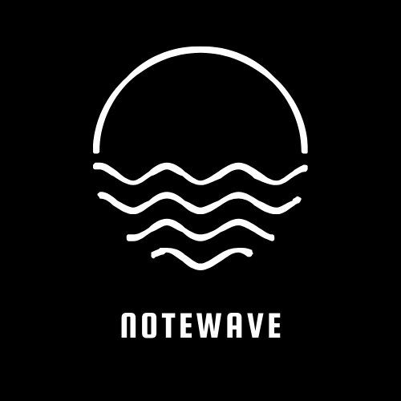

# Notewave



## Overview

Notewave is a feature-rich, web-based productivity and collaboration tool, inspired by Notion. It is built with React, Next.js, Next.js Router, Tailwind CSS, Clerk, Convex, and Edge Store, using TypeScript and Shadcn for enhanced development. Although it does not currently support real-time collaboration on pages, it allows users to easily share pages with everyone.


## Features

- **Rich Text Editing:** Create and edit notes with a variety of formatting options, including headings, lists, and inline styles.
- **Task Management:** Keep track of tasks with to-do lists and checkboxes.
- **Page Sharing:** Share pages easily with others for collaborative viewing.
- **Responsive Design:** The application is designed to be responsive and work seamlessly across different devices.

## Technologies Used

- **React:** A JavaScript library for building user interfaces.
- **Next.js:** A React framework for building server-side rendered and statically generated web applications.
- **Next.js Router:** A routing library for Next.js applications.
- **Tailwind CSS:** A utility-first CSS framework for rapidly building custom designs.
- **Clerk:** An authentication library for Next.js applications.
- **Convex:** A state management library for React applications.
- **Edge Store:** A storage library for client-side storage.
- **TypeScript:** A superset of JavaScript that adds static typing.
- **Shadcn:** A library for managing and applying shadows in web applications.

## Getting Started

### Prerequisites

- Node.js and npm

### Installation

1. Clone the repository:

    ```bash
    git clone https://github.com/your-username/notionwave.git
    cd notionwave
    ```

2. Install dependencies:

    ```bash
    npm install
    ```

3. Start the development server:

    ```bash
    npm run dev
    ```

4. Open the application in your browser at [http://localhost:3000](http://localhost:3000).

## Usage

- Create a new document or note by clicking the "+" button.
- Share pages with others using the provided sharing functionality.
- Edit text by clicking on the content and using the formatting toolbar.
- Manage tasks using the task management features.

## License

This project is licensed under the MIT License - see the [LICENSE](LICENSE) file for details.

## Acknowledgments

- Inspiration: Notion (https://www.notion.so/)
- Icons: [FontAwesome](https://fontawesome.com/)
